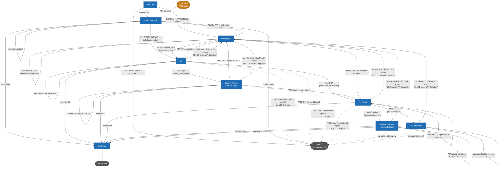

# Research Report

## Handoff Path Diagram



**Notes**

1. **Non-dep blocker**: `blocked_by.type` is `decision`, `external`, or `technical` — PM returns `IN_PROGRESS` to stay in the PM loop until resolved. Dependency-blocked WPs (type `dependency`) are skipped here.
2. **PM dynamic routing**: READY WPs route to `assigned_to` or the owner of the WP's `firstActiveStage`. IN_PROGRESS WPs route to the owner of the next pending pipeline stage (guarded: skip if that stage is already IN_PROGRESS or FAIL, or if its upstream is still IN_PROGRESS).
3. **§21.71 cross-WP dispatch** (`findNextReadyDispatch`): when a non-PM agent's role-specific work is done but READY unstarted WPs exist, the handoff routes to the owner of the first active stage of the first such WP. The diagram shows → Developer as the typical target (first stage = `implementation`), but the actual target is dynamic — it could be any pipeline-owning agent depending on `active_pipeline_stages` of the READY WP.
4. **⚠️ §21.71-B gap**: when WPs with a PASS pipeline have heterogeneous downstream next-agents (e.g., some → Security Auditor, others → Reviewer), the mixed-routing branch fires before `findNextReadyDispatch` is reached, returning WAIT. The orchestrator's supervisor loop handles dispatch; the IDE stalls. See Recommendation section for the proposed fix.
5. **Optional stages**: `security-audit` and `release-engineering` are opt-in per WP via `active_pipeline_stages`. WPs without these stages skip those agents entirely.

---

## Problem Statement

`ledger_get_next_action` called by the QA agent returns `WAIT` with the reason
`"No work packages ready for QA. All WPs either lack implementation pipelines or
already have QA pipelines."` and a `handoff_status.details` of `"3 WPs ready for
next stage but route to multiple agents (Security Auditor, Reviewer)."` — even
though v1.29.0 was understood to eliminate these WAIT stalls via `findNextReadyDispatch`.

## Problem Decomposition

1. What does v1.29.0's `findNextReadyDispatch` actually cover?
2. Which code path produces the observed WAIT and why?
3. Is this a bug or intentional design?
4. Is there a gap between the §21.71 fix and the observed scenario?

---

## Context & Constraints

- MCP server is at v1.29.0 (confirmed via `mcp-server/package.json`).
- The call is `ledger_get_next_action` (not `ledger_get_handoff_status`).
- 3 WPs have a PASS `qa` pipeline and are awaiting downstream stages.
  - Some WPs have `security-audit` as their next active stage → Security Auditor.
  - Other WPs have `code-review` as their next active stage → Reviewer.
  - The mix of next-agents is what triggers the observed branch.

---

## Investigation: Two Distinct Code Paths

### Path A — `ledger_get_next_action` → `getQaAction()`

`src/tools/workflow-next-action.ts`, function `getQaAction()`:

1. Loops over all WPs where `qa` is in `active_pipeline_stages`.
2. Applies per-WP priorities P1–P7 (rework limits, FAIL routing, re-engagement,
   `RUN_QA`, `CLAIM_WP`, etc.).
3. WPs that already have a PASS `qa` pipeline **fail every priority check silently**:
   - Not at rework limit.
   - Not a FAIL pipeline.
   - No pending re-engagement trigger.
   - Already have QA coverage — no `RUN_QA` action needed.
4. Loop exhausts with no match → falls through to the final **fallback WAIT**
   at line 923:
   ```json
   { "action": "WAIT",
     "reason": "No work packages ready for QA. All WPs either lack
                implementation pipelines or already have QA pipelines." }
   ```

### Path B — `embedHandoffStatusInWait()` → `computeHandoffStatus()` → `getQAHandoff()`

Because the action is `WAIT`, `embedHandoffStatusInWait()` in
`src/tools/workflow-next-action-batch.ts` calls `computeHandoffStatus()`, which
dispatches to `getQAHandoff()` in `src/tools/workflow-handoff.ts`.

`getQAHandoff()` runs its own priority steps:
- **Step 1**: No re-engagement (no QA FAIL + upstream re-pass). Skip.
- **Step 2**: No FAIL WPs. Skip.
- **Step 3** ← **FIRES HERE**:
  - Finds 3 WPs with a PASS `qa` pipeline awaiting a next stage.
  - `partitionWpsAwaitingNextStage()` marks them `ready`.
  - `nextStatus` is `null` because `resolveNextAgent()` returns *different* values
    across the 3 WPs (Security Auditor for some, Reviewer for others).
  - Hits the **mixed-routing branch**:
    ```typescript
    return buildHandoffResponse(
      'QA', 'WAIT',
      `${ready.length} WPs ready for next stage but route to multiple agents
       (${[...nextAgents].join(', ')}).
       Per-agent ledger_get_next_action ticks will dispatch each WP individually.`,
      ...
    );
    ```
  - **Returns WAIT immediately. Steps 4–5 (including `findNextReadyDispatch`)
    are never reached.**

This Step 3 result is embedded as `handoff_status` in the outer WAIT response,
producing the exact output the user observed.

---

## What v1.29.0's `findNextReadyDispatch` Actually Covers

`findNextReadyDispatch()` sits at **Step 5** of `getQAHandoff()`. It is reached
only when Steps 1–4 all fall through — meaning:

- No QA FAILs needing re-engagement.
- No QA FAILs awaiting Developer rework.
- **No WPs with PASS QA awaiting any next stage** (the `wpsPassedQa` list is empty,
  or all such WPs are dependency-blocked).
- No IN_PROGRESS WP assigned to QA.

In that state, `findNextReadyDispatch()` scans for **READY WPs that have no
pipelines at all** (unstarted WPs). If found, it cross-routes to the agent who
owns the first active stage of the first such WP — preventing the IDE stall
described in §21.71.

**The §21.71 fix addresses:** QA finishes all its own work → unstarted READY WPs
exist → without the fix, QA returns WAIT and the IDE stalls because no `auto_handoff`
target fires.

**What it does NOT address:** QA has completed all QA pipelines → WPs are awaiting
downstream stages that belong to *multiple different agents simultaneously* → Step 3
fires (mixed-routing) → `findNextReadyDispatch` at Step 5 is never reached.

---

## Comparative Evaluation

| Scenario | Step 3 fires? | `findNextReadyDispatch` reached? | Result |
|---|---|---|---|
| All PASS-QA WPs → same next agent (e.g. all → Security Auditor) | Yes, `nextStatus` non-null | No (Step 3 routes deterministically) | `READY_FOR_SECURITY_AUDITOR` ✓ |
| PASS-QA WPs → **multiple** next agents | Yes, `nextStatus` null | No (Step 3 returns WAIT) | `WAIT` ← observed scenario |
| QA has no WPs at all / all PASS-QA WPs are dependency-blocked | No (Step 3 skipped) | Yes | Cross-routes to unstarted READY WPs ✓ |

---

## Is This a Bug?

**No — for the orchestrator.** The comment "Per-agent `ledger_get_next_action` ticks
will dispatch each WP individually" is the accurate description of orchestrator
behaviour: the supervisor loop polls each agent in parallel, so Security Auditor and
Reviewer each discover their own READY WPs on the next tick without needing QA to
explicitly route to them. Returning WAIT here is functionally correct.

**Possibly — for IDE mode.** When the IDE receives a WAIT with no `auto_handoff`
target, the workflow stalls. The user must manually invoke the next agent (Security
Auditor or Reviewer). This is the same class of IDE stall as §21.71 — it is just a
*different trigger* (mixed downstream routing rather than unstarted READY WPs).

---

## Gap Analysis

The v1.29.0 fix (§21.71) closed one class of IDE stall:

> **Closed:** non-PM agent finishes role-specific work → no more role-specific WPs →
> unstarted READY WPs exist → was: WAIT stall; now: cross-routes via
> `findNextReadyDispatch`.

A **second class of IDE stall remains unaddressed** in v1.29.0:

> **Open (§21.71-B):** non-PM agent (QA) finishes all its own pipelines → PASS WPs
> are waiting for downstream stages → downstream stages map to **multiple different
> agents** → Step 3 mixed-routing branch fires → WAIT with no `auto_handoff` →
> IDE stall.

If all post-QA WPs mapped to the *same* next agent (e.g., all required
`security-audit`), Step 3 would return `READY_FOR_SECURITY_AUDITOR` with
`auto_handoff` populated and the workflow would continue without stalling.

The stall only occurs when WPs in the same project are heterogeneous in their
downstream pipeline configuration.

---

## Recommendation

**Short term (no code change required):** The observed WAIT is expected behaviour.
The orchestrator's supervisor loop handles this correctly. If running in IDE mode,
manually invoke Security Auditor or Reviewer after QA returns WAIT with mixed-routing
`handoff_status`. The `handoff_status.details` field names the target agents
explicitly.

**Medium term — close §21.71-B for IDE mode:**

The mixed-routing WAIT in `getQAHandoff` Step 3 could be changed to route
deterministically to the **first** WP's next agent instead of returning WAIT.
Concretely, replace:

```typescript
// Current: mixed-routing → WAIT
return buildHandoffResponse('QA', 'WAIT', `... route to multiple agents ...`);
```

with:

```typescript
// Proposed: pick the first ready WP's next agent, let the supervisor/next tick
// handle the remainder
const firstWp = ready[0]!;
const targetRole = resolveNextAgent(
  'qa',
  (firstWp.active_pipeline_stages as PipelineType[] | undefined) ?? DEFAULT_PIPELINE_STAGES
);
const targetStatus = READY_STATUS_FOR_ROLE[targetRole as AgentRole] ?? 'READY_FOR_DEVELOPER';
return buildHandoffResponse(
  'QA', targetStatus,
  `${ready.length} WPs passed QA; routing to ${targetRole} for ${firstWp.work_package_id} first. Remaining WPs will be dispatched on subsequent ticks.`,
  undefined, projectPath, store
);
```

**Trade-offs of the proposed fix:**

| Criterion | Current (WAIT) | Proposed (first-WP routing) |
|---|---|---|
| Orchestrator correctness | ✓ (supervisor handles it) | ✓ (no regression; supervisor handles rest) |
| IDE correctness | ✗ (stall on mixed routing) | ✓ (one agent auto-dispatched) |
| Parallelism | ✓ (supervisor dispatches all simultaneously) | Slight degradation (sequential in IDE mode) |
| Auditability | ✓ (WAIT makes it explicit) | Acceptable (reason string names all targets) |
| Spec update required | — | §13.1 QA handoff algorithm, §21.71-B new edge case |

The fix is low-risk and consistent with the existing §21.71 approach. It should be
accompanied by a new edge case §21.71-B in the workflow specification and a test
covering the mixed-routing scenario.

### Proof-of-Concept Outline

1. Add a test fixture with 3 WPs: 2 with `active_pipeline_stages: ['implementation','qa','security-audit']`, 1 with `active_pipeline_stages: ['implementation','qa','code-review']`. All have PASS implementation + PASS qa pipelines, status IN_PROGRESS.
2. Call `getQAHandoff()` — confirm current behaviour returns WAIT (mixed routing).
3. Apply the proposed change to Step 3.
4. Re-run — confirm `READY_FOR_SECURITY_AUDITOR` is returned (routes to first WP).
5. Confirm that subsequent Security Auditor + Reviewer ticks each find their own WPs correctly.

---

## Open Questions

- Should the "first-WP routing" pick the **numerically first** WP or the WP whose
  downstream stage has highest priority? Current PM routing uses order from the root
  index, which is consistent and predictable — adopting the same tie-break is
  recommended.
- Should the mixed-routing WAIT in `getReviewerHandoff` and other Step 3 equivalents
  receive the same fix? A quick audit: Reviewer's Step 3 also has a mixed-routing
  branch with the same structure. A single generalised fix applied to all five
  affected handoff functions would be preferable over patching each individually.

---

## References

- `mcp-server/src/tools/workflow-handoff.ts` — `getQAHandoff()` Step 3 mixed-routing
  branch (lines ~795–825); `findNextReadyDispatch()` implementation (lines ~430–463)
- `mcp-server/src/tools/workflow-next-action.ts` — `getQaAction()` fallback WAIT
  (line 923)
- `mcp-server/src/tools/workflow-next-action-batch.ts` — `embedHandoffStatusInWait()`
- `mcp-server/changelog.md` — v1.29.0 entry (Cross-WP Dispatch)
- `mcp-server/docs/agents/workflow-specification/edge-cases.md` — §21.71
  (Cross-WP Dispatch from Non-PM Agents)
- `mcp-server/docs/agents/workflow-specification/handoff.md` — §13.1 QA handoff
  algorithm, §13.5 `findNextReadyDispatch` algorithm
